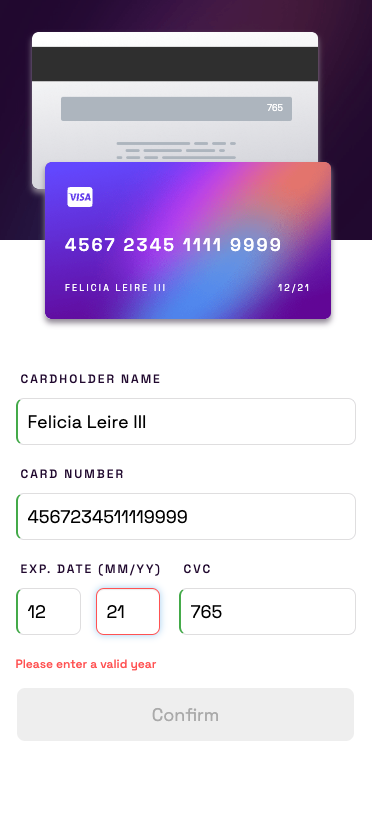
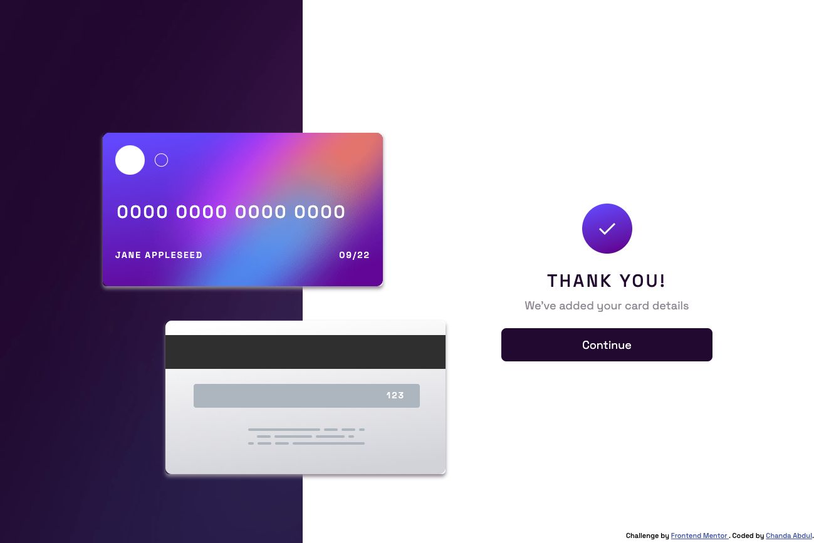
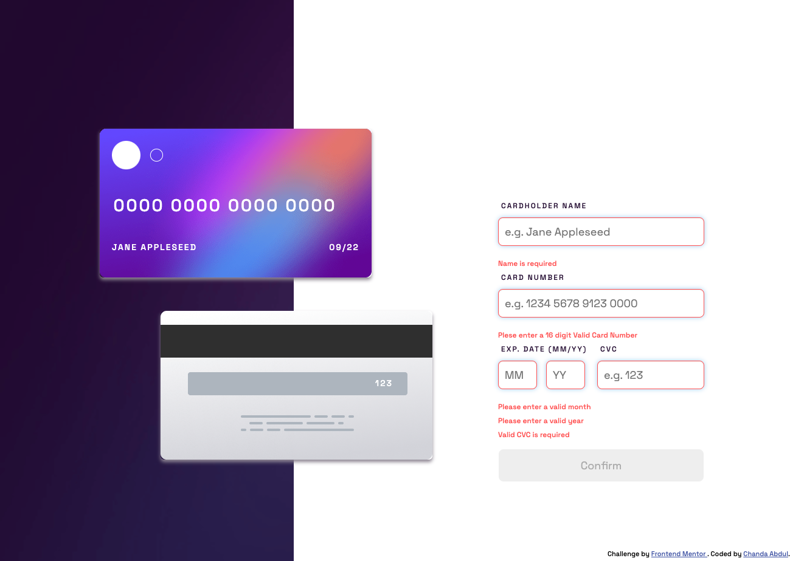
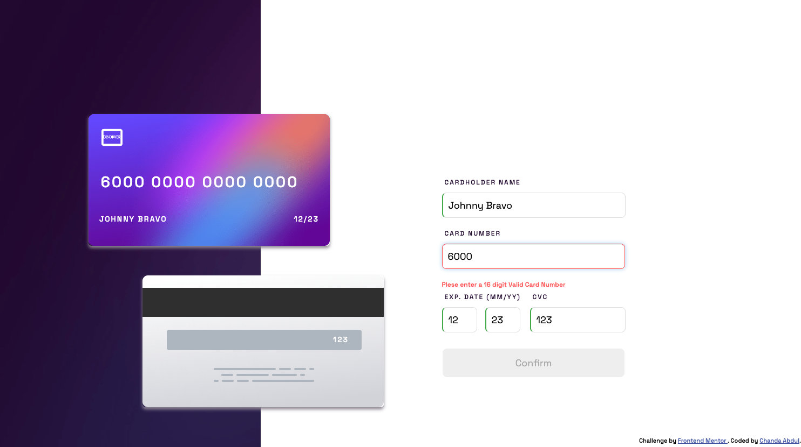
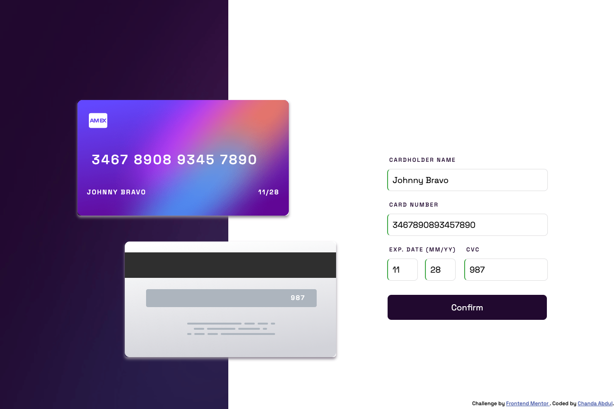
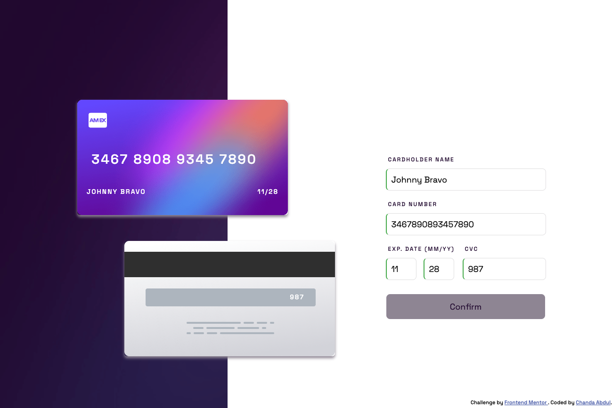

# Frontend Mentor - Interactive card details form solution


This is a solution to the [Interactive card details form challenge on Frontend Mentor](https://www.frontendmentor.io/challenges/interactive-card-details-form-XpS8cKZDWw). Frontend Mentor challenges help you improve your coding skills by building realistic projects. 

## Table of contents

- [Overview](#overview)
  - [The challenge](#the-challenge)
  - [Screenshot](#screenshot)
  - [Links](#links)
- [My process](#my-process)
  - [Built with](#built-with)
  - [What I learned](#what-i-learned)
  - [Continued development](#continued-development)
  - [Useful resources](#useful-resources)
- [Author](#author)
- [Acknowledgments](#acknowledgments)
## Overview

### The challenge

Users should be able to:

- [X] Update the inputs on the form as the user fills in the fields and see the card details update in real-time
- [X] Validate the form fields when the form is submitted and receive error messages when the form is submitted if:
  - [X] Any input field is empty
  - [X] The card number, expiry date, or CVC fields are in the wrong format
- [X] If there are no errors, display the completed state
- [X] Reset the form when the user clicks "Continue" on the completed state
- [X] View the optimal layout depending on their device's screen size
- [X] See hover, active, and focus states for interactive elements on the page

### Screenshot
#### Mobile View @ `375px`


#### Desktop View @ `1440px`








### Links

- Solution URL: [View Solution Code](https://github.com/Chanda-Abdul/Angular-Interactive-Card-Details-Form-Frontend-Mentor)
- Live Site URL: [View live site](#)

## My process

### Built with

- <b>[Angular](https://angular.io/)</b> (<b>JavaScript</b> framework)
  - [Angular Template Driven Forms](https://angular.io/guide/forms)
  - [TypeScript](https://www.typescriptlang.org/)
  - [JavaScript](https://www.javascript.com/)
    - [Regular expressions](https://developer.mozilla.org/en-US/docs/Web/JavaScript/Guide/Regular_Expressions)
- <b>CSS</b> custom properties
  - <b>Mobile-first</b> workflow
- Semantic <b>HTML5</b> markup
- <b>Figma</b>

### What I learned

<!-- Use this section to recap over some of your major learnings while working through this project. Writing these out and providing code samples of areas you want to highlight is a great way to reinforce your own knowledge.

To see how you can add code snippets, see below:

```html
<h1>Some HTML code I'm proud of</h1>
```
```css
.proud-of-this-css {
  color: papayawhip;
}
```
```js
const proudOfThisFunc = () => {
  console.log('🎉')
}
```

If you want more help with writing markdown, we'd recommend checking out [The Markdown Guide](https://www.markdownguide.org/) to learn more. -->

### Continued development


- [ ] 🔜 add animations
- [ ] 🔜 Deploy

- [ ] 🤷🏽‍♀️ add date `FormGroup`
- [ ] 🤷🏽‍♀️ move confirmation screen functionality to `ConfirmationComponent`
- [ ] 🤷🏽‍♀️ igure out formatting for `input` <b>Regex Form Validators</b>

### Useful resources

- [Angular - The Complete Guide (2022 Edition) by Maximilian Schwarzmüller](https://www.udemy.com/course/the-complete-guide-to-angular-2) - This is an amazing article which helped me finally understand XYZ. I'd recommend it to anyone still learning this concept.
- [Introduction to forms in Angular](https://angular.io/guide/forms-overview) - This is an amazing article which helped me finally understand XYZ. I'd recommend it to anyone still learning this concept.
  - [Building a template-driven form](https://angular.io/guide/forms) - This helped me for XYZ reason. I really liked this pattern and will use it going forward.
  - [Reactive forms](https://angular.io/guide/reactive-forms) - This helped me for XYZ reason. I really liked this pattern and will use it going forward.
- [Sharing data between child and parent directives and components](https://angular.io/guide/inputs-outputs) - This helped me for XYZ reason. I really liked this pattern and will use it going forward.
- [Event binding](https://angular.io/guide/event-binding) - This helped me for XYZ reason. I really liked this pattern and will use it going forward.
  - [Angular 12 - Sharing data between child and parent components with `@Input` and `@Output` decorators.](https://youtu.be/qspoPXaF_Aw) - This is an amazing article which helped me finally understand XYZ. I'd recommend it to anyone still learning this concept.
- [`*NgSwitch` Directive](https://angular.io/api/common/NgSwitch) - This helped me for XYZ reason. I really liked this pattern and will use it going forward.
- [Pattern Validator](https://angular.io/api/forms/PatternValidator) - This helped me for XYZ reason. I really liked this pattern and will use it going forward.
  - [Regex for Leading Card Networks](https://stackoverflow.com/questions/9315647/regex-credit-card-number-tests) - This helped me for XYZ reason. I really liked this pattern and will use it going forward.
  - [Regular expression for first and last name](https://stackoverflow.com/questions/2385701/regular-expression-for-first-and-last-name) - This helped me for XYZ reason. I really liked this pattern and will use it going forward.


## Author

- Frontend Mentor - [@Chanda-Abdul](https://www.frontendmentor.io/profile/Chanda-Abdul)
- Website - [Chanda Codes](https://chandacodes.com/)
- GitHub - [github.com/Chanda-Abdul](https://github.com/Chanda-Abdul)
 ## Acknowledgments
<!--
This is where you can give a hat tip to anyone who helped you out on this project. Perhaps you worked in a team or got some inspiration from someone else's solution. This is the perfect place to give them some credit. -->


###### #Angular #Template-Driven-Form #JavaScript #TypeScript #Validators #RegEx
